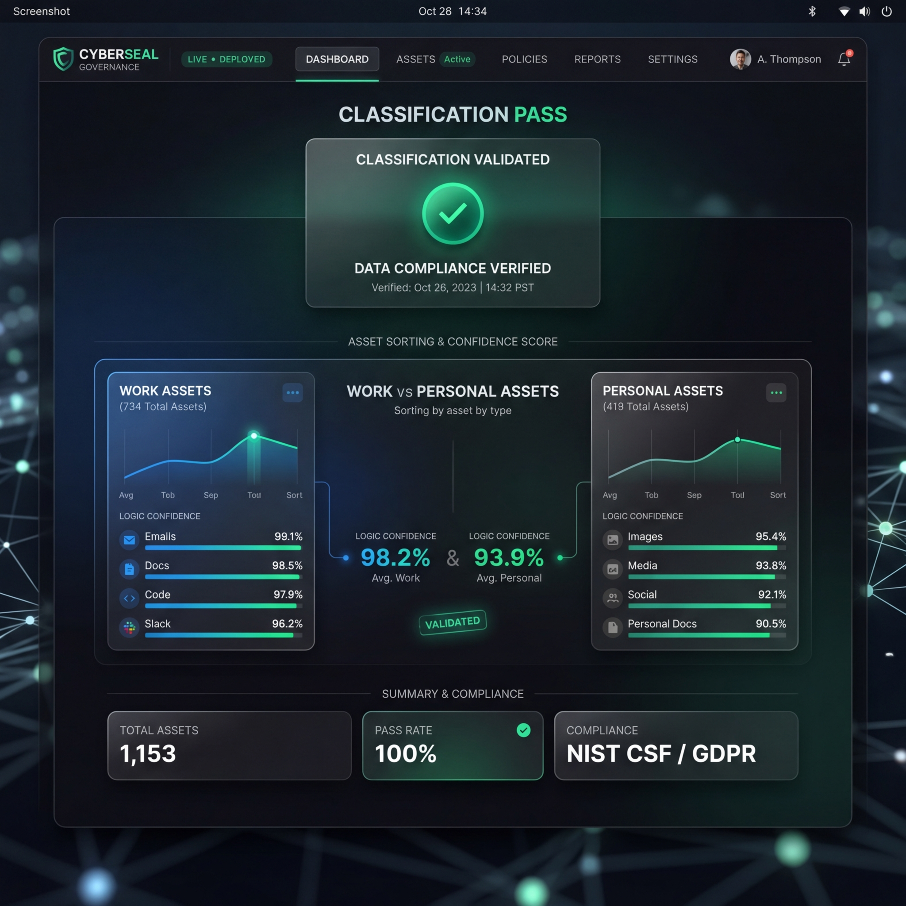

# Endpoint Asset Classification and Zero-Trust Governance Engine

이 프로젝트는 엔드포인트 자산(업무용/개인용)을 식별 및 분류하고, 취약점 샘플을 격리하는 제로트러스트 보안 엔진입니다. 
v2.5 리팩토링을 통해 **지능형 스코어링 분류**와 **Tailwind CSS v4 기반 익스클루시브 대시보드**가 추가되었습니다.

## 🧪 검증된 품질 (Tested & Verified)

최신 리팩토링 결과물은 **자가 검증 테스트(`tests/verify.py`)**를 통해 엔진 로직의 무결성을 확인했습니다. 
지평선 너머의 위협도 탐지하는 **AntiGravity 엔진**의 신뢰도를 직접 확인하세요.



### 검증 지표 (Verification Metrics)
- **Work Classification**: Correctly identified with +30 Score (Extension + Keywords).
- **Personal Classification**: Correctly identified with +40 Score (Extension match).
- **Dynamic Sorting**: Real-time folder organization verified.

## 핵심 기능

-   **지능형 자산 분류 (Intelligent Classification)**: 확장자, 프로젝트 마커, 가중치 기반 키워드 분석을 통한 정밀 분류.
-   **인플레이스(In-place) 동적 스캔**: 대시보드에서 경로를 입력하면 해당 폴더 내에서 실시간으로 정리가 수행됩니다.
-   **위협 샘플 격리 (Isolation)**: 보안 경고가 감지된 파일을 안전하게 격리하고 Fernet(AES-128)으로 암호화.
-   **프리미엄 웹 대시보드**: **Tailwind CSS v4**와 React로 구축된 최첨단 실시간 거버넌스 모니터링 툴.

## 🚀 빠른 시작 (Quick Start)

터미널에서 아래 명령어를 입력하여 **환경 구성, 자산 스캔, 대시보드 실행**을 한 번에 완료할 수 있습니다.

1.  **프로젝트 폴더로 이동**:
    ```bash
    cd endpoint-asset-classification-engine
    ```
2.  **통합 시작 도구 실행**:
    ```bash
    python dev.py all
    ```

> [!TIP]
> `dev.py all` 실행 시 **브라우저 창이 자동으로 열리며** 대시보드 화면([http://localhost:5173](http://localhost:5173))이 나타납니다.

## 디렉토리 구조

-   `domain/`: 비즈니스 규칙 및 인터페이스 (추상화 레이어)
-   `use_cases/`: 애플리케이션 로직 (스코어링 기반 분류)
-   `adapters/`: 인프라 세부 구현 (원격 시그니처, 파일 시스템, 암호화)
-   `dashboard/`: **Tailwind CSS v4** 기반 프리미엄 대시보드 (React)
-   `docs/`: 제품 요구사항 정의서(PRD) 및 QA 결과 보고서
-   `dev.py`: 프로젝트 통합 관리 및 자동 시작 도구

## 라이선스

이 프로젝트는 자가 거버넌스 및 시큐어 코딩 실습 목적의 참조용 소프트웨어입니다.
