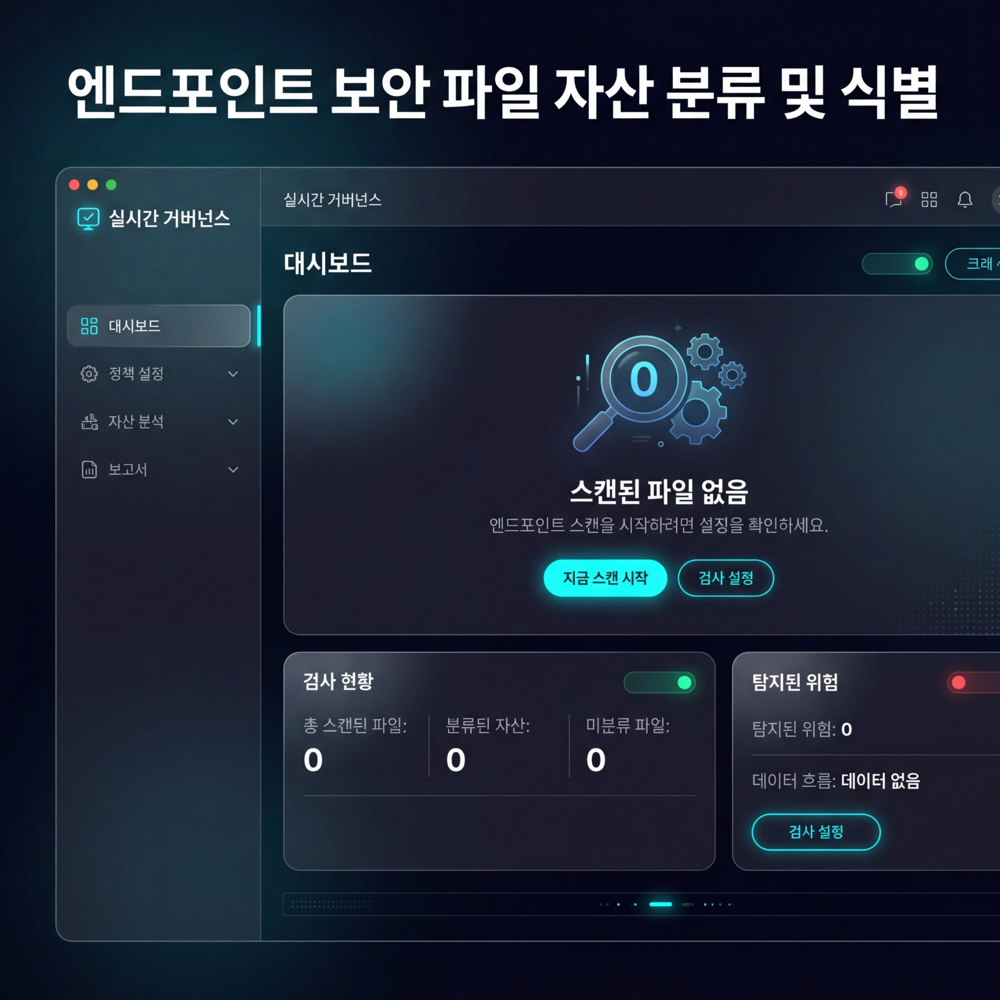
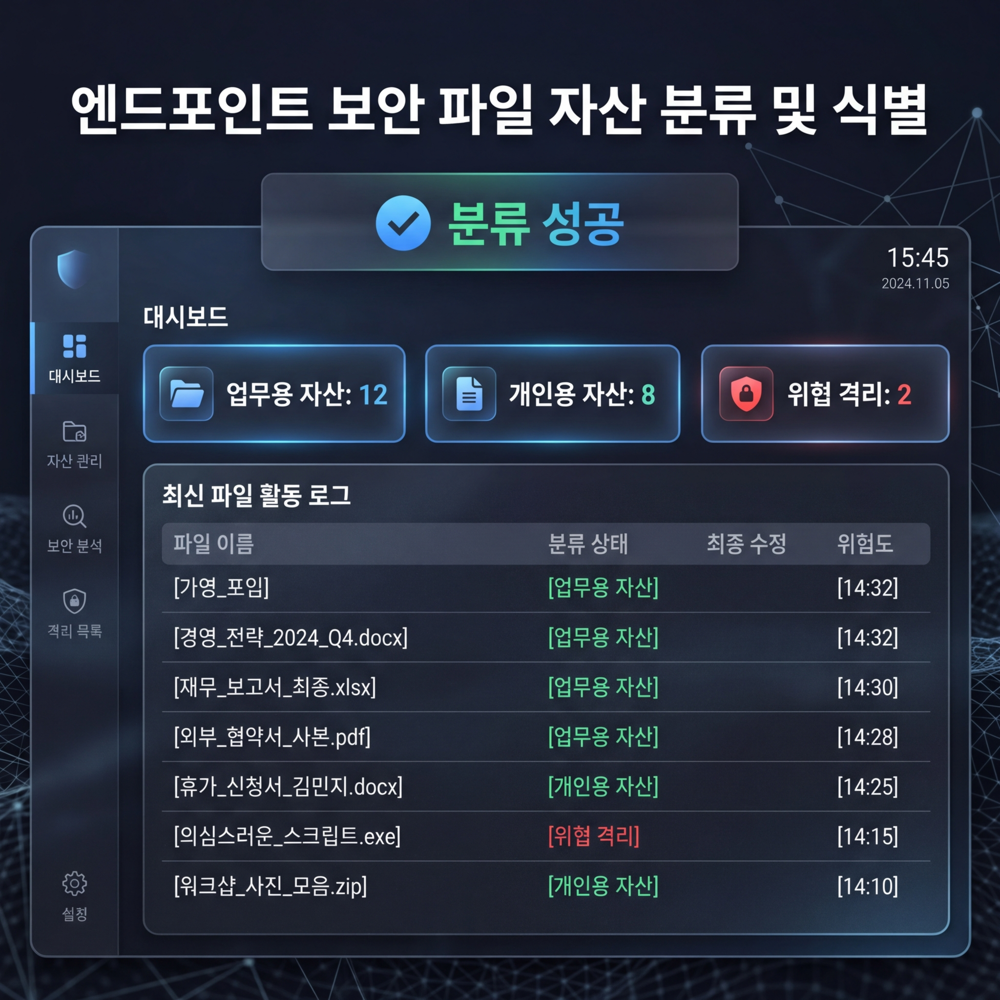

# 엔드포인트 보안 파일 자산 분류 및 식별 (AntiGravity Engine)

이 프로젝트는 엔드포인트 자산(업무용/개인용)을 실시간으로 식별 및 분류하고, 취약점 샘플을 격리하는 차세대 제로트러스트 보안 거버넌스 엔진입니다. 
v2.5 리딩 리팩토링을 통해 **지능형 스코어링 분류**와 **사용자 정의 경로 스캔** 기능을 탑재했습니다.

---

## 🌐 라이브 데모 (Live Preview)
웹 환경에서 시뮬레이션 기능을 통해 대시보드의 UI와 분류 프로세스를 미리 체험해 볼 수 있습니다.
- **[대시보드 실시간 데모 보기](https://glory903-devsecops.github.io/endpoint-asset-classification-engine/)**
  *(GitHub Actions를 통해 자동으로 배포 및 업데이트됩니다.)*

## 📺 시스템 인터페이스 (Product Showcase)

````carousel

<!-- slide -->

<!-- slide -->

````

---

## 💻 로컬 실행 가이드 (Local Setup)
실제 내 컴퓨터의 파일을 실시간으로 분류하고 관리하려면 로컬 환경에서 실행하십시오.

1.  **프로젝트 폴더로 이동**:
    ```bash
    cd endpoint-asset-classification-engine
    ```
2.  **통합 시작 도구 실행**:
    ```bash
    python dev.py all
    ```
3.  **브라우저 접속**: [http://localhost:5173](http://localhost:5173) (자동 실행 지원)

---

## ⚙️ 핵심 아키텍처 및 기능
-   **지능형 스코어링**: 확장자뿐만 아니라 프로젝트 마커(.git 등)와 가중치 기반 키워드를 분석하여 분류 신뢰도를 극대화.
-   **동적 인플레이스 스캔**: 대시보드 상단에 경로를 입력하면 해당 폴더 내에서 실시간으로 `Work_Assets`, `Personal_Assets` 폴더를 생성해 파일을 정리.
-   **위협 샘플 격리**: 보안 경고가 감지된 파일은 즉시 암호화(AES-128) 후 격리 저장소로 이동.
-   **Tailwind v4 프리미엄 UI**: 현대적인 다크 모드와 글래스모피즘(Glassmorphism) 스타일의 고해상도 대시보드.

## 📁 프로젝트 구조
-   `domain/` / `use_cases/`: 비즈니스 로직 및 인터페이스 (SOLID 준수)
-   `adapters/`: 파일 시스템, 암호화, API 등 세부 구현체
-   `dashboard/`: React + Vite + Tailwind CSS v4 기반 프론트엔드
-   `tests/`: 핵심 로직 무결성 검증용 테스트 코드
-   `dev.py`: 프로젝트 통합 관리 및 자동 시작 컨트롤러

## 📄 라이선스
이 프로젝트는 자가 거버넌스 및 시큐어 코딩 실습을 위한 배포용 오픈소스입니다.
